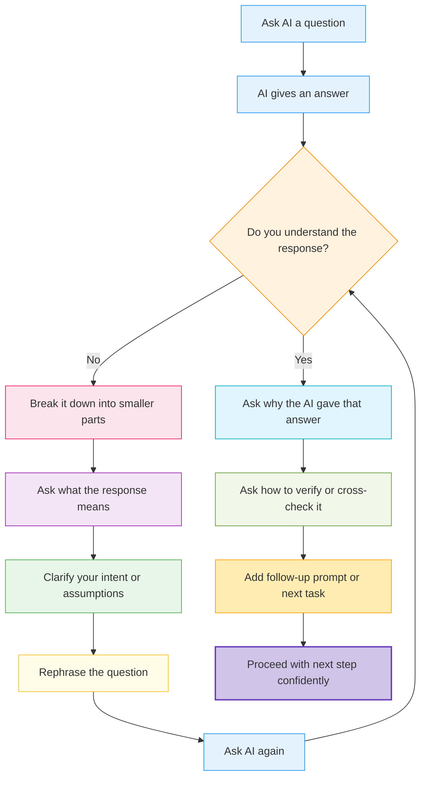

# AI Interaction Flowchart


_A framework for navigating AI responses with clarity, control, and curiosity._

***

## ️ Why This Flowchart Exists


Most people ask questions.\
Few follow through.\
Fewer still reflect on what the answer means.

This flowchart exists to help you:

* Avoid blind acceptance of AI outputs
* Build self-awareness while prompting
* Use checkpoints before continuing to the next step
* Prevent snowballing confusion from compounding

***

## ️ The Prompting Flowchart


> _Ask a question. If you don’t get it, ask again. If you do, ask why. That’s how smart people learn._




***

###  How This Works


Let’s say you asked AI:

> “Explain blockchain to a 10-year-old.”

AI says:

> “Blockchain is a distributed ledger using cryptographic consensus...”

You don’t understand. So:

* ❌ You **don’t move forward yet**.
* ✅ You ask: “What does ‘distributed ledger’ mean?”
* Then: “Can you use a toy trading example?”
* Now you get a simpler version: “A notebook shared between friends to track trades.”

💡 This loop helps you **refine your thinking** before moving to “What’s next?”

***

##  Section-by-Section Breakdown


### 1. **Ask AI a Question**


This is your initial interaction — asking for help, information, clarity, or insight.\
It can be open-ended or specific.

> ✅ Tip: Use the 6-part prompt framework for better results.

***

### 2. **AI Gives an Answer**


The system responds with its best guess based on patterns, context, and your phrasing.

> ⚠️ Don’t stop here. This is where most users get it wrong — assuming the answer is complete or correct just because it sounds good.

***

### 3. **Do You Understand the Response?**


Stop and ask yourself:

* Is the response clear to you?
* Do you know what to do next?
* Does it answer your _real_ intent?

If **no** → Go left\
If **yes** → Go right

***

### 4. ❌ If You Dont Understand...


####  Break It Down


Ask:

> “What does this _really_ mean?”\
> “What part is confusing?”\
> “Am I assuming it knows something I didn’t say?”

***

####  Clarify Intent or Assumptions


Rewrite your prompt to:

* Add missing context
* Reduce ambiguity
* Remove abstract language or filler words

Then re-ask with improved clarity.

***

### 5. ✅ If You Do Understand...


> Don't stop here. Understanding is just the start. Now ask:

####  Why Is It Saying This?


What part of your question led it here?\
Is it repeating your words or actually reasoning?\
What assumptions does this reflect?

***

####  How Can You Verify It?


Use follow-up prompts like:

```
Can you cite your source?
What are the top 3 critiques of this answer?
How would an expert challenge this view?
```

Verification builds trust — not blind usage.

***

### 6.  Then - and only then - Continue


Once you’ve:

* Understood
* Reflected
* Verified

→ Continue the conversation.\
→ Give the next task.\
→ Move deeper into your workflow.

***

##  Real-World Example


> **Prompt:**\
> “Summarize Nietzsche’s philosophy in simple terms.”

**AI Response:**

> “Nietzsche believed in the ‘will to power,’ which means striving for excellence and overcoming obstacles. He also said ‘God is dead,’ which means people no longer find meaning in religion.”

**Now, apply the flowchart:**

* **Do you understand it?** → Kinda.
* **What does ‘will to power’ actually mean?** → Ask that next.
* **How do I verify this?** → Ask: “Can you give a real-life example?”
* **Clarify intent:** “I want to understand Nietzsche’s ideas on morality, not just his famous quotes.”

Now you’re **in a loop of thinking**, not just taking notes.

***

##  Why This Works


This flowchart gives you:

* A **systematic, repeatable way** to engage with AI
* **Built-in reflection points** to improve your own thinking
* Protection against **false confidence** and **information inflation**

***

##  Final Reflection


* Do you usually stop after one answer?
* Do you trust something more if it sounds fluent?
* What happens when you loop back instead of moving on?

> ✨ AI won’t make you smarter. But reflecting on AI’s answers — **will**.

***

##  Bonus Activity


Try this mini-audit on your next AI session:

| Step | What You Did | Did You Reflect? | Did You Loop Back? |
| ---- | ------------ | ---------------- | ------------------ |
| 1    |              | ✅ / ❌            | ✅ / ❌              |
| 2    |              | ✅ / ❌            | ✅ / ❌              |
| 3    |              | ✅ / ❌            | ✅ / ❌              |

> Prompt. Pause. Proceed. Repeat.

That’s how good thinking grows.

***
