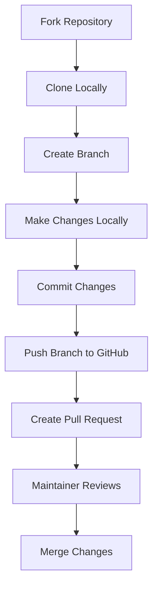

# GitHub Contribution Guide for Writers

> A professional workflow and best practices documentation tailored for writers contributing to open-source projects on GitHub.

***

## 📖 Table of Contents

* [Understanding GitHub Terminology](contribution-guide.md#understanding-github-terminology)
* [Recommended Workflow](contribution-guide.md#recommended-workflow)
* [Best Practices for GitHub Contributions](contribution-guide.md#best-practices-for-github-contributions)
* [Common Gaps and How to Avoid Them](contribution-guide.md#common-gaps-and-how-to-avoid-them)
* [Essential Git Commands for Writers](contribution-guide.md#essential-git-commands-for-writers)
* [Creating Professional Contributions](contribution-guide.md#creating-professional-contributions)
* [Next Steps for Writers](contribution-guide.md#next-steps-for-writers)

***

## Understanding GitHub Terminology

| Term                  | Explanation                                                | Importance                                                 |
| --------------------- | ---------------------------------------------------------- | ---------------------------------------------------------- |
| **Repository (Repo)** | A project folder that contains all your files.             | Central workspace for collaboration.                       |
| **Fork**              | Your personal copy of another user's repository.           | Allows experimentation without affecting original content. |
| **Clone**             | Creating a local copy of a repository on your computer.    | Facilitates offline editing and version control.           |
| **Branch**            | Independent workspace for features or changes.             | Prevents disruption of stable content.                     |
| **Pull Request (PR)** | A request to integrate your changes into the main project. | Enables code review and collaboration.                     |

***

## Recommended Workflow

### Fork the Repository

* Navigate to the original repository.
* Click **Fork** to create your copy.

**Flow:**

```
Original Repo → Fork
```

### Clone Your Fork Locally

Clone your fork to your computer using terminal:

```bash
git clone https://github.com/YourUsername/repo-name.git
cd repo-name
```

### Create a Branch

Create a new branch for each contribution:

```bash
git checkout -b my-documentation-improvements
```

**Flow:**

```
Main Branch → New Branch → Local Changes
```

### Make and Commit Your Changes

Edit files locally, then commit:

```bash
git add .
git commit -m "Added workflow guide for new writers"
```

### Push Your Branch

Push your local branch to GitHub:

```bash
git push origin my-documentation-improvements
```

**Flow:**

```
Local Branch → GitHub Fork Branch
```

### Create a Pull Request (PR)

* Navigate to your fork.
* Click **Compare & pull request**.
* Provide clear descriptions:
  * Problem solved
  * Value added
  * Steps to verify

**Flow Diagram:**

```
Forked Branch → PR → Maintainer Reviews → Merge
```

### Respond to Feedback

* Address feedback promptly.
* Maintain clear communication.

***

## Best Practices for GitHub Contributions

### ✅ Always

* Fork and branch before changes.
* Use clear commit messages.
* Keep PRs focused and concise.
* Describe PRs clearly.

### ❌ Never

* Push directly to main/master branch.
* Use unclear commit messages.
* Ignore requested changes.
* Combine unrelated changes.

***

## Common Gaps and How to Avoid Them

### Gap: Not Creating Branches

**Issue:** Potential overwriting or breaking content.

**Solution:** Always branch off from main.

### Gap: Poor Documentation/Commit Messages

**Issue:** Difficult reviews, unclear context.

**Solution:** Provide clear descriptions and meaningful commit messages.

### Gap: Large, Unfocused PRs

**Issue:** Challenging review process, delays.

**Solution:** Break contributions into smaller PRs.

***

## Essential Git Commands for Writers

| Command                         | Explanation                    |
| ------------------------------- | ------------------------------ |
| `git clone [url]`               | Copies repo locally            |
| `git branch [name]`             | Creates a new branch           |
| `git checkout [name]`           | Switches branch                |
| `git checkout -b [name]`        | Creates/switches to new branch |
| `git add [file]`                | Stages file                    |
| `git commit -m "message"`       | Commits changes                |
| `git push origin [branch-name]` | Pushes changes                 |
| `git status`                    | Checks changes                 |

***

## Creating Professional Contributions

Ensure contributions are:

* Clear, concise, and readable
* Properly formatted (Markdown standards)
* Purpose-driven (what, why, how clearly defined)
* Collaborative (responsive to feedback)

***

## Next Steps for Writers

* **Practice:** Contribute incrementally.
* **Document:** Clearly document contributions.
* **Engage:** Participate actively in discussions.

***

## Contribution Workflow Visual



***

## Final Thoughts

> "Effective open-source contributions are not just technical—they're fundamentally about clear communication and collaboration."

***
