# Getting Started with REAPER

A complete, beginner-focused guide to installing and configuring REAPER—the lightweight, flexible, and powerful digital audio workstation.

<p align="center">
  
</p>

---

## Why This Guide Exists

REAPER updates often, but installation steps stay consistent. This guide covers:

- **Download** REAPER  
- **Install** on Windows or macOS  
- **Configure** audio settings  
- **Troubleshoot** common issues  

Version-specific notes are included where they matter.

---

## System Requirements

| Platform    | Requirements                                                                 |
|-------------|-------------------------------------------------------------------------------|
| **Windows** | • Windows 7 or later (32- or 64-bit)<br>• ~20 MB free disk space<br>• (Optional) ASIO-compatible audio interface |
| **macOS**   | • macOS 10.5+ (up to Sonoma)<br>• Universal build for Intel & Apple Silicon<br>• CoreAudio (no extra drivers required) |

> **Tip:** REAPER is exceptionally lightweight—most modern systems run it without issue.

---

## Download REAPER

1. Go to [reaper.fm](https://reaper.fm).  
2. Click **Download REAPER**.  
3. Choose your OS:  
   - **Windows 64-bit**  
   - **macOS Universal**  

> **Note:** The version number may differ, but these steps apply.

---

## Install REAPER

### Windows

```bash
# Run the installer
./REAPER_installer.exe
```

1. Double-click the downloaded `.exe`.  
2. Accept the license agreement.  
3. Choose an install location (default is fine).  
4. (Optional) Enable **Portable Install** to keep settings self-contained.  
5. Click **Install**.

### macOS

```bash
# Mount and install
open REAPER.dmg
cp -R /Volumes/REAPER/REAPER.app /Applications/
```

1. Mount the downloaded `.dmg`.  
2. Drag **REAPER.app** into **Applications**.  
3. Right-click **REAPER.app** → **Open** (to bypass Gatekeeper).  

> **Note (Ventura+):** You may need to allow REAPER under **System Settings → Security & Privacy**.

---

## Configure Audio Settings

1. Launch REAPER.  
2. Navigate to **Options → Preferences → Audio → Device**.

- **Windows**  
  - **ASIO** (low-latency) for external interfaces  
  - **WASAPI** for built-in speakers  

- **macOS**  
  - **CoreAudio** auto-selects your device  

> **Tip:** If you hear no sound, double-check your device and increase the buffer size.

---

## Understand Theme & Layout

REAPER 7’s default theme introduces:

- Floating track controls  
- Updated icons & spacing  
- Improved routing panels  

> **Note (v7.0):** To revert to the classic look, go to **Options → Themes → Default_6.0**  
> **Note (v7.1+):** Expect refined meter contrast and lane behavior.

---

## Troubleshooting

| Issue                     | Solution                                              |
|---------------------------|-------------------------------------------------------|
| No audio output           | Check **Preferences → Audio → Device** settings       |
| App won’t launch (macOS)  | Right-click **Open** or allow under **Security & Privacy** |
| Hidden track lanes        | Right-click TCP → **Enable Track Lanes**              |
| Audio glitches or pops    | Increase buffer size or adjust sample rate            |

---

## Version-Specific Notes

- [REAPER v7.0 Theme & Layout](../v7.0/index.md)  
- [REAPER v7.1+ Refinements](../v7.1/index.md)

---

## What’s Next

1. **Insert** a new track: _Track → Insert new track_  
2. **Drag** an audio file into the timeline  
3. **Press** ▶️ to play  

Explore plugins, MIDI mapping, automation, and more in the subsequent guides.

> **Feedback welcome:** Open an issue or submit a pull request to improve this guide.
